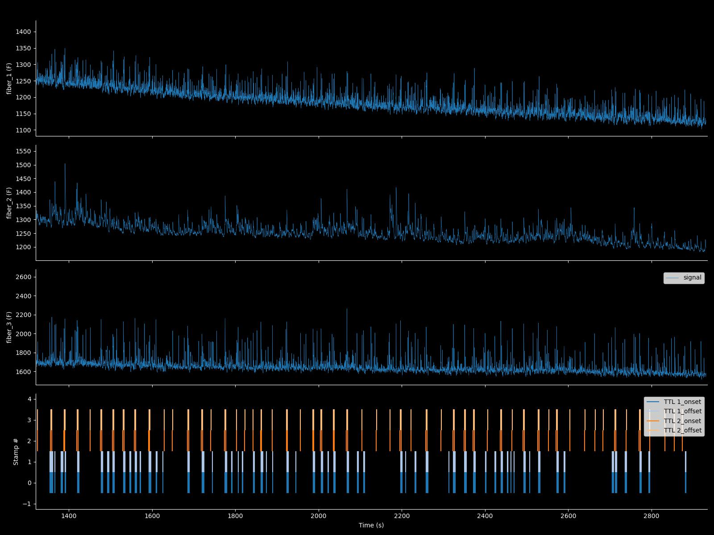

# Fipster Python
Fipster Python is actively maintained and updated. There is no GUI, but you can use matplotlib controls (both task bar as well as code) to control figure behavior. Fipster_python is completely Matplotlib and Pandas based and can be conveniently incorporated into an analysis pipeline, for instance into a Jupyter Notebook. The basic structure of the code is as follows. There are two main classes, "FIP_signal" and "Sweepset". This is how they work:

## FIP_signal
Contains the main dataset. To get started from a Python script or Jupyter Notebook import the Fipster code and load a dataset like so:

```python
import sys
sys.path.append('path/where/you/installed/Fipster_python/')
import Fipster as fip

# To load the data
signal = fip.FIP_signal('your/filename/here.mat')
```

You can also run Fipster_Python directly from the command line. This will present the complete dataset in a figure and make the dataset available in your workspace as an object named "signal'.

    $ipython -i fipster.py ../raw_data/example_1.mat 
(This will load the example data, change this to load you own data)

If you run FIPSTER from the command line, have a look at the end of code under __name__ == '__main__' and include your own 'main' function with formatting and/or normalization rules.

### Overview of the available methods and important properties
Note: the examples below suppose you loaded your dataset in an object named "signal" as demonstrated above. To get a complete overview of all methods and their docstrings type "dir(signal)". To read the docstring of a particular method use the 'help' function like so:

```python
dir(signal) # Will print a list of properties and methods
help(signal) # Will print available docstrings of methods
help(signal.plot) # Will print docstring of the 'plot' method
help(signal.derive_timestamps) # Will print docstring of the "derive_timestamps" method
# etc..
```
### Properties:
- signal.settings: a dict with the settings the most important one of which is called "fit ref" which can be set to
    - "polyfit": (DEFAULT) will fit the 405nm and 470nm trace using a polynomal fit
    - "means": will fit the signal means
    - "rolling polyfit": will fit using a polynomal fit executed on a rolling window
    - "no fit": will not fit the 405nm and 470nm traces
- signal.timestamps: a dict where derived or imported timestamps are stored
    - Include new stamps simply so: signal.timestamps['my_new_stamps'] = np.array([list of times in 's'])
- signal.facecolor, .axcolor & .colormap
    - formatting options for your plots. Will include more in the future.

### Methods:
- signal.plot: will plot the signal
    - Use the "raw_data" and "timestamps" parameters to indicate what data you want to see plotted
- signal.derive_timestamps: derive timestamps from all or one particular analog input channel
- signal.peri_event: will output a peri-event (sweepset) object, see below.
- signal.sync_time: used to align the timeline of the 'signal' object with some external dataset.
- signal.quick_peri: essentially a wrapper for "derive_timestamps" and "peri_event" to quickly make a PEH of your FIP data
- signal.import_signal: to include an additional signal in the object
    - For instance: I've used this to include the temporal derivative of a FIP signal into the dataset.
    - Active development: not very robust.
- signal.get_data: get your fitted and/or normalized data for use in the rest of your code.
- signal.get_ref: get your fitted reference trace.


### What FIP_signal.plot() looks like:
This is with facecolor = 'k' and axcolor='w'



## Sweepset
This is the standard peri-event dataset class. It is usually created by using the 'peri_event' or 'quick_peri' methods of the FIP_signal class. Again: use 'dir' and 'help' to read docstrings of the included methods.

These examples suppose you named our sweepset object PE:

### Properties:
- PE.settings: dict with baseline and normalization settings
- PE.selector: list of bools about which trials (sweeps) to include in your analysis (used to exclude individual trials)
- PE.facecolor & .axcolor: formatting rules

### Methods
- PE.get_data: get normalized peri-event data:
    - Note: this uses PE.settings to normalize based on a baseline window.
- PE.make_Figure: Plot all channels
- PE.get_average: to get the response averaged over the trials.
    - Note that if you have enough trials, it is almost always better to use auROC instead of the average (Z-score or dF) response to combine/compare multiple animals/recordings.
- PE.auroc: To get the auROC-normalized response:
    - For trial-based assays, this has many advantaged over Z-score normalization (if you have enough trials!): The idea is from [Cohen et al. Nature 2012](https://www.nature.com/articles/nature10754). Specifically, it is in figure S1 of that paper.

### What sweepset.make_figure() looks like:


## Example code
Have a look at <b>FIP_example.py</b> for an overview of what an analysis could look like. 