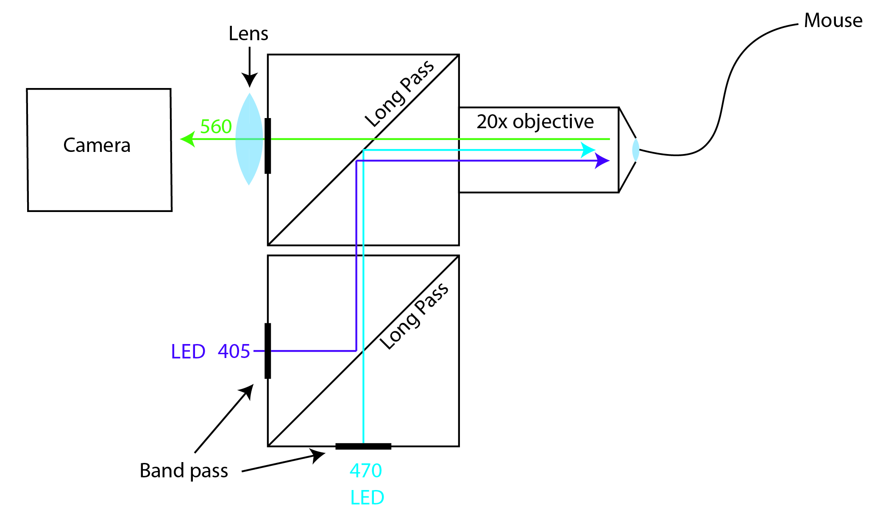

# Fipster
Fipster is a set of Matlab scripts used for the acquisition of fiber photometry (FIP) data on camera-based systems. It consists of:

1. A wiki detailing how to build your own multi-fiber multi-color system.
2. MATLAB acquisition code (FIP_acquisition) that will run the system.
3. A GUI-based analysis pipeline in MATLAB (Fipster_Matlab)
4. Code base analysis code in Python (Fipster_Python)

## How to build your own FIP setup
Camera-based FIP setups can be build relatively cheap using of-the-shelf parts. They are very flexible and can be used for multi-color and multi-fiber experiments as well as experiments that combine both FIP and optogenetics. To get started have a look at the [wiki](https://github.com/handejong/Fipster/wiki) and put your own setup together using the parts_list.xlsx file.

## To get started with the MATLAB analysis code

    >> signal = FIP_signal('User input');

This will open a GUI where one can select a .mat file containing signal (Calcium depended, CD) and reference (405nm emission) traces. There are currently two supported formats. One is that exported by Fipgui (Deisseroth lab) the other is the .mat files exported by the FIP_aquisition class which is also part of this toolbox. If a LogAI file with the same name is found in the same folder, this file will be imported as well. Most likely it should be straightforward to process data obtained using the neurophotometrics as well.

*Click on the example for an example GUI walk trough on YouTube.*

## Fipster Python
To get started with the Python-based FIP analysis code have a look at FIP_example.py

## auROC normalization
Fipster python allows for auROC normalization, which has a lot of advantaged over z-score normalization for trial-based assays. The idea is from [Cohen et al. Nature 2012](https://www.nature.com/articles/nature10754). Specifically, it is in figure S1 of that paper.